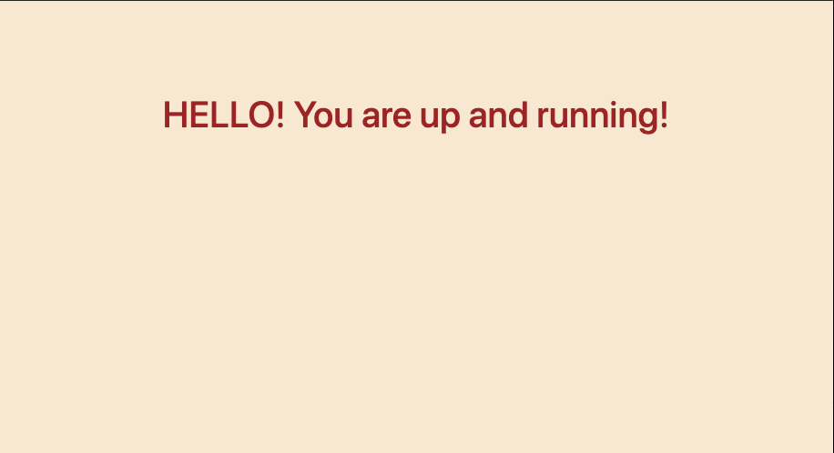
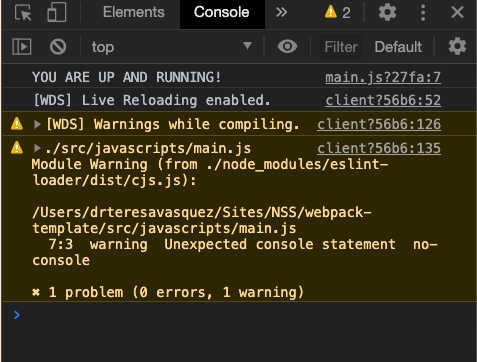

# Name of Project: Vocab-You-lary Project


## Overview of the project: 
 - This is NOT A TEST. We are not looking for 100% completion, although if you can make it work completely, then wahoo!

- What we are looking for is effort, critical thinking about the concepts, creative thinking to bind the concepts together for a solution, and collaboration with your teammates and instruction team.

- If you only get 50% of it complete, but display the above Core Skills and can demonstrate understanding of the fundamental code concepts, then you are learning and growing - which is what we care about.

## dbdiagram 
- [VOcab-YOU-lary wireframe](https://dbdiagram.io/d/613faf4c825b5b01460045a1.png)

## Wireframe
- [VOcab-YOU-lary wireframe](https://docs.google.com/presentation/d/1LvAtJbGJLXdzQ5BUPb1-VKv8eVM2ge5U38RABk7OGr4/edit#slide=id.p.png)

## Link to the deployed project 
 - [Netlify Deployment]()

## Project board
- [Link to Vocab-YOU-lary Project Board](https://github.com/Nissa2424/Vocab-YOU-lary-)

##Loom Video 
- [ShortVideo](https://www.loom.com/share/6dd8d810c2a04778b54f26fc0386a685)

------------------------------------------------------------------------------
# Webpack Intro

[See Live Demo of this Template](https://webpack-5-template.netlify.app)

Webpack is a task runner and a module bundler. It originally started as a module bundler. This means that it takes all of your separate Javascript modules and bundles them together into a single file. Webpack also automates some of the tasks that we have to run every time we change the code. It will automate these tasks so that we are not typing in the same commands every single time.

## Topics
- [Get Started](#get-started)
- [Starting the Project](#starting-the-project)
- [Other important tidbits](#other-important-tidbits)
    - [Console messages](#console-messages)
    - [Including images with webpack](#including-images-with-webpack)
    - [Importing CSS](#importing-cssscss)
    - [Using axios](#using-axios)
    - [Deploying on Netlify](#deploying-on-netlify)
___

## Get Started

### Use Template
#### 1. To get started, click the GREEN "Use this Template" button at the top of the repo


#### 2. Make sure YOUR github account is selected in the dropdown and name your project


3. Clone your new repo to your local machine
4. Go to the **NEXT** section

## Starting the Project
1. Open the `package.json` file and change the `name` property to the name of your application, and `author` to  your name.
1. Rename the `.sample.env` file to `.env` file. The final file name should be `.env`
1. From your command line, be in the root directory and run `npm install` OR `npm i` for short.
1. To start your application, run `npm start`

### If you see this, you are set to go!


**NOTES:** 
- Changes you make to the project will make the browser reload on save...no more hard refresh unless something goes wrong.
- You will no longer be using the `hs -o` command. To start your server, you will run `npm start`

## Other Important Tidbits
### Console messages
From this time forward, you will be expected to have a clean console in order for your assignments to be approved. This means that the use of `console.log` is acceptable **_(debugger is WAY better though)_** while developing, but will throw an error in your console like the image below, but all `logs` will have to be removed. You may use `console.error` and `console.warn` in your code however for messages. These need to all be removed before pushing to production unless they contain vital info for the user/developer.



### Including Images with Webpack
If you have a folder of local images that you want to load into your code things get a little strange with webpack.  Remember the only way webpack knows about assets is if they are imported into your javascript files.  Even our CSS is not added until those files are imported into our javascript files.  Below is some sample code for how to load a local image file into your project

```js
import cat from './assets/cat.jpg';

let domString = ``;

document.getElementById('cat').innerHTMl = domString;
```

### Importing CSS/SCSS
**NOTE:** We will be using SCSS files. They are used the same way your CSS files work, with some added benefits that we will discuss later.

Since Webpack is making the connection to the JS and CSS for us and we are no longer manually adding links or script tags to our HTML, we have to get our styles to the application some way...

Here is how we add our styles using webpack:

```js
import '../styles/main.scss';

const init = () => {
  document.querySelector('#app').innerHTML = '<h1>HELLO! You are up and running!</h1>');
  console.log('YOU ARE UP AND RUNNING!');
};

init();
```

### Using Axios
> For every file you will need to make an XHR request in, you will need to require Axios
```js
import axios from 'axios';

const examplePromise = () => {
  axios.get('http://localhost:3001/example')
    .then((data) => {
      console.warn(data);
    })
    .catch((error) => {
      console.error(error);
    });
});
```

### Deploying on Netlify

- Build Command: `npm run build`
- Publish directory: `dist`
- Add Environmental Variables (NOT REQUIRED for Apps that do not use API Keys, etc)
    - Any Enviromental variables you are using in your `.env` file should be added to Netlify. 
        - Go to Site settings > Build & deploy > Environment > Environment variables and the keys and values there.

- Update Firebase URL Settings
    - In Firebase under Authentication select sign in methods, scroll to Authorized domains. Add your Netlify URL.
        
## More Info and Resources on Webpack
- Visit the [Webpack documentation](https://webpack.js.org/concepts/) if you want to explore more.
- [Info on our Webpack Config](https://github.com/nss-nightclass-projects/Night-Class-Resources/blob/master/book-2-patterns-and-tools/chapters/webpack-configure.md)
